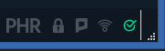

# Phore Masternode VPS Installation

This masternode installation script vastly simplifies the setup of a Phore masternode running on a virtual private server (VPS), and it also adds a number of other powerful features, including:

* IPv6/IPv4 Support
* With IPv6 Installs 1-100 (or more!) Phore masternodes in parallel on one VPS, with individual phore.conf and data directories
* With IPv4, You can install 1 Phore masternodes per IPv4 address
* It can install masternodes for other coins on the same VPS as Phore
* 100% auto-compilation and 99% of configuration on the masternode side of things
* Automatically compiling from the latest Phore release tag, or another tag can be specified
* Some security hardening is done, including firewalling and a separate user, increasing security
* Automatic startup for all masternode daemons

Some notes and requirements:

* Script has only been tested on a Vultr VPS, but should work almost anywhere where IPv6 addresses are available
* Currently only Ubuntu 16.04, 18.04 LTS is supported
* This script needs to run as root!

This project was forked from https://github.com/masternodes/vps. @marsmensch (Florian) is the primary author behind this VPS installation script for masternodes. If you would like to donate to him, you can use the BTC address below

**Have fun, this is crypto after all!**

```
BTC  33ENWZ9RCYBG7nv6ac8KxBUSuQX64Hx3x3
```

# Install guide on vultr

## How to get VPS server

For new masternode owners, **Vultr** is recommended as a VPS hosting provider, but other providers that allow direct root SSH login access and offer Ubuntu 16.04, 18.04 may work.

You can use the following referral link to sign up with Vultr for VPS hosting:

<a href="https://www.vultr.com/?ref=7316561"></a>

## Deploy a new system

First, create a new VPS by clicking that small "+" button.


## Location choice

You can choose any location. You may wish to have it hosted in a city/country near you, or choose a different area to help with the global decentralization of the Phore masternode network.


## Linux distribution (Ubuntu 16.04/18.04 LTS)

Select Ubuntu 16.04/18.04.


## VPS size

The 25 GB SSD / 1024MBB Memory instance is enough for 2-3 masternodes. You may need more memory as the Phore blockchain grows over time, or if you want to run more masternodes.


## Activating additional features (IPv6)

Toggle "Enable IPv6" to activate that feature--at Vultr there is no additional cost for this.


You may wish to enable DDOS Protection to protect your masternodes against a potential denial of service attack, especially if you are running multiple masternodes from one VPS. Vultr charges an additional fee for this.

## Hostnames & number of VPS

Choose how many instances you want and click "Deploy Now".


## Installation of PuTTY as SSH client (Windows)
If you are running your wallet from Windows, install PuTTY while the server is being set up. You can download PuTTY from here: http://www.putty.org/. Skip this step if you are using a Mac--you will use the built in Terminal application instead.

Once PuTTY is installed, return to the Vultr dashboard to get the login details by clicking on the ... to the right of your server, and select Server Details.

## Accessing your VPS via SSH

Copy your password for SSH access from the server details page.


Now open PuTTY to add the server.


Enter the IP address in the Host Name field, and enter the server name you wish to use for this VPS (e.g., MN01) to Saved Sessions. Click save.

Click the open button. When the console has opened, click Yes in the PuTTY Security Alert box.


Now enter your server login details provided in your Vultr account.
You cannot Ctrl+V to paste in the console. Either right click the mouse or type shift+insert (sometimes
on keyboard it will just be INS key)

User: root
Password: (paste or type password)

When you paste it will not display, so don't try to paste again.
Just paste once and press Enter.

For Mac users, open Terminal (e.g., Press Command-Space and type Terminal and press Enter). Then type:

```
ssh -l root <IP address>
```

## Install Masternode

Login to your newly installed node as "root".


### Install One Phore Masternode
Enter this command to copy the Masternode installation script and install a single Phore Masternode with IPv6:

```bash
git clone https://github.com/phoreproject/vps.git && cd vps && ./install.sh -p phore -g -x
```

With IPv4 address:
```bash
git clone https://github.com/phoreproject/vps.git && cd vps && ./install.sh -p phore -n 4 -g -x
```

This prepares the system and installs the Phore Masternode daemon. This includes downloading the latest Phore masternode release, creating a swap file, configuring the firewall, and compiling the Phore Masternode from source code, generate configuration file and masternode privkey. This process takes about 20-30 minutes.


While that is underway, go back to your local desktop and open phore-qt.

### Install Multiple Phore Masternode
Enter this command to copy the Masternode installation script and install a single Phore Masternode with IPv6:
```bash
git clone https://github.com/phoreproject/vps.git && cd vps && ./install.sh -p phore -c 3 -g -x
```
`-c 3` term means 3 phore masternodes.

IPv4: You can't install automatically with multiple IPv4 address with this script.

## Update Mastenode
  You should first remove the old version of the VPS script so that the new one you download is tagged with the latest version, and then you add a -u parameter to upgrade existing nodes:

  ```bash
  rm -rf /root/vps
  ```
  ```bash
  git clone https://github.com/phoreproject/vps.git && cd vps && ./install.sh -p phore -u
  ```

  The project is configured to use the latest official release of the Phore masternode code, and we will update this project each time a new release is issued, but without downloading the latest version of this project and using the -u parameter, the script will not update an existing Phore node that is already installed.

### Complex Situations
- In single masternode installation, if you already generated masternode private key
  Enter this command.
  ```bash
  git clone https://github.com/phoreproject/vps.git && cd vps && ./install.sh -p phore -x -k **PRIVATE KEY**
  ```

  **PRIVATE KEY** means your generated masternode private key. For example,
  ```bash
  git clone https://github.com/phoreproject/vps.git && cd vps && ./install.sh -p phore -x -k 87AqVXXXXXERNJxqBGdSS9LDS2vXXXXX5RdiiNd1zM7YAM7SHWX
  ```
  In this script, you can find configuration in masternode.conf in your PC.
  enter this to check it.
  ```bash
  cat /tmp/phore_masternode.conf
  ```
  and add these lines to your masternode.conf.

- In multiple masternodes installation and if you already have your masternode private keys, you can add them as shown below (all entered on one line):

  ```bash
  git clone https://github.com/phoreproject/vps.git && cd vps && ./install.sh -p phore -c 3 -x --key **PRIVATE KEY 01** --key2 **PRIVATE KEY 02** --key3 **PRIVATE KEY 03**
  ```
  Using this command, you can skip the step for "Configure masternode configuration files", because the command above adds the masternode private keys to the masternode configuration files.

- If you are adding new masternode, (and if you installed 2 masternodes already)
  ```
  git clone https://github.com/phoreproject/vps.git && cd vps && ./install.sh -p phore -x -c 3
  ```
  if you want to use --key option, add --key3 **MASTERNODE PRIVKEY 03**. You are able to use
  ```
  git clone https://github.com/phoreproject/vps.git && cd vps && ./install.sh -p phore -c 3 -g -x
  ```
  for new 3rd masternode.

## End of installations

When the script finishes, it will look similar to this:


Copy **VPS IP** and **Priv Key** to a text file. It will be needed for configuration in Phore wallet(in this example, VPS IP is [2001:19f0:7001:fd4:e2b7::1]:11771, Priv Key is 87KsYyqumG9HJjG000008jtpSEQUKSuEWkBG9xov19cuEsXH5vB).

*Tips*: If you installed multiple masternode, copy each *VPS IP*, *Priv Key*.

You only have a few steps remaining to complete your masternode configuration.

## Configure Phore Wallet
### Step1 - Create Collateral Transaction

Once the wallet is open on your local computer, generate a new receive address in *Receive* tab and label it however you want to identify your masternode rewards (e.g., Phore-MN-1). This label will show up in your transactions each time you receive a block reward.

Click the Request payment button, and copy the address.


Now go to the *Send* tab, paste the copied address, and send *exactly* 10,000 PHR to it in a single transaction. Wait for it to confirm on the blockchain. This is the collateral transaction that will be locked and paired with your new masternode. If you are setting up more than one masternode at one time, repeat this process for each one.


### Step 2 - Make New Masternode Configuration
Go to the *Masternodes* Tab and click **ADD MASTERNODE** button.

This will open *New Masternode Alias* window.


Click **AUTOFIL OUTPUTS** button. It autofills Priv Key, Output, Output ID.
If Output(ID) isn't filled, wait 1~2 mins.
Then enter *Alias Name*, *VPS IP*, *Priv Key*.
*Alias Name* means your masternode name(Only for identify), *VPS IP* is your VPS server IP which was copied in [End of installations](#End-of-installations).
In this example, *Alias Name* is phore-mn01 and *VPS IP* is [2001:19f0:7001:fd4:e2b7::1]:11771, *Priv Key* is 87KsYyqumG9HJjG000008jtpSEQUKSuEWkBG9xov19cuEsXH5vB.


If you are setting up multiple masternodes, repeat this step for each one.

*Tips:* If you want, you can generate Priv Key here, but you will need to edit masternode configuration file manually on VPS(See [Add masternode private key](#Add-masternode-private-key)).

## Check syncing status of masternode

The masternode cannot complete activation until it is fully synced with the Phore blockchain network.

To check the status of your masternode, please enter this command in the VPS terminal. If you have multiple masternodes on the same VPS, you can change n1 to n2 etc. below to check the status of each one.

```bash
/usr/local/bin/phore-cli -conf=/etc/masternodes/phore_n1.conf getinfo
```
The output will look like this:
```
{
  "version": 1050100,
  "protocolversion": 70006,
  "walletversion": 61000,
  "balance": 0.00000000,
  "privatesend_balance": 0.00000000,
  "blocks": 606209,
  "timeoffset": 0,
  "connections": 44,
  "proxy": "",
  "difficulty": 42882.54964804553,
  "testnet": false,
  "moneysupply" : 11814171.53907114,
  "zPHRsupply" : {
      "1" : 263.00000000,
      "5" : 135.00000000,
      "10" : 500.00000000,
      "50" : 700.00000000,
      "100" : 1300.00000000,
      "500" : 5000.00000000,
      "1000" : 11000.00000000,
      "5000" : 90000.00000000,
      "total" : 108898.00000000
  },
  "keypoololdest" : 1507302593,
  "keypoolsize" : 1001,
  "paytxfee" : 0.00000000,
  "relayfee" : 0.00010000,
  "staking status" : "Staking Not Active",
  "errors" : ""
}
```

We're looking at the *blocks*, and need that to be the latest block in the blockchain. You can check your local wallet to see the latest block by hovering over the green check mark.



Once your masternode has synced up to the latest block, go to next step. The syncing process may take 15-30 minutes or more as the Phore blockchain grows. You can keep checking progress with the command above, by pressing the up arrow and Enter to repeat it.

## Start Masternode

Go *Masternodes* tab and click each masternode then click **START ALIAS** button. If you get "successful started", your masternode was finally activated!

Tips: Sometimes you get *error*, go to the debug console of your Phore wallet **[Tools->Debug Console]** and enter the following command, replacing **mn-alias** with the name of the masternode in the Alias column of the Masternodes tab:

```
startmasternode alias false mn-alias
```

You may need to unlock the wallet **[Settings->Unlock Wallet]** before you run this command, entering your passphrase. You can lock the wallet after it is finished.

If everything was setup correctly, after entering the command you will see something like this:
```
{
"overall" : "Successfully started 1 masternodes, failed to start 0, total 1",
"detail" : {
"status" : {
"alias" : "phore-mn01",
"result" : "successful"
}
```
If you are setting up multiple masternodes, repeat this for each one. You can now close the debug console, return the Masternodes tab and check the status:


It should say ENABLED, and within an hour, the timer in the Active column should start increasing.

Your Phore masternode is now set up and running! Depending on how many masternodes there are, it may take 24-30 hours before you see your first masternode reward--this is normal and rewards should come at more regular intervals after the first one.


## With Manually installation
## Configure masternode configuration files

Since this installation method supports multiple masternodes, the phore configuration files have a node number added to them (e.g., phore_n1.conf, phore_n2.conf), stored in the /etc/masternodes directory. If you have a single masternode on the VPS, you will only need to edit /etc/masternodes/phore_n1.conf.

To open phore_n1.conf for editing, enter these commands:
```bash
sudo apt-get install nano
nano /etc/masternodes/phore_n1.conf
```
The next step adds your masternode private key.

## Add masternode private key

What you need to change is only masternode private key.
(We recommend using IPv6 which is the default, but if you choose IPv4 when you ran the installation script, please edit #NEW_IPv4_ADDRESS_FOR_MASTERNODE_NUMBER to your VPS IP address).
After typing the nano command, you will see something similar to this.


Copy the masternode private key from the text file you saved it in, and replace HERE_GOES_YOUR_MASTERNODE_KEY_FOR_MASTERNODE_phore_1 with that private key (this typically begins with an 8).

While you have this file opened, copy the information that follows after masternodeaddr=, starting with the open bracket. This is the masternode's IPv6 address and port, and will be needed for the wallet's masternode.conf file.

Once you have your masternode private key entered, press <font color="Green">Ctrl+X</font> .
Then press <font color="Green">Y</font> to save, and press Enter to exit.

Finally, close and restart your Phore wallet so that it will have the new masternode configuration.

## Tips
### Check masternode status on VPS Server
You can check your masternode status on VPS server. Use this command.
```
/usr/local/bin/phore-cli -pid=/var/lib/masternodes/phore1/phore.pid -conf=/etc/masternodes/phore_n1.conf -datadir=/var/lib/masternodes/phore1 masternode status
```
If it returns
```
{
  "txhash": "a7eba991be786ce80948e9099e26f6a816317b2142f9e5e12abea357f885d0f2",
  "outputidx": 1,
  "netaddr": "[2001:19f0:5c01:457:2044::6]:11771",
  "addr": "PEtMbHEuqo1QHs7Xy2wCTTmugAuemyd2mU",
  "status": 4,
  "message": "Masternode successfully started"
}
```
like this, Your masternode is successfully started(Please check txhash, outputidx are same as your masternode.conf).

You can start and stop masternode client manually. Enter this commands.
### To stop
```
/usr/local/bin/phore-cli -pid=/var/lib/masternodes/phore1/phore.pid -conf=/etc/masternodes/phore_n1.conf -datadir=/var/lib/masternodes/phore1 stop
```

if use this command, masternode client will restart automatically in 5sec.
To stop completely,
```
service phore_n1 stop
```

### To start
```
/usr/local/bin/phored -daemon -pid=/var/lib/masternodes/phore1/phore.pid -conf=/etc/masternodes/phore_n1.conf -datadir=/var/lib/masternodes/phore1
```

If you stopped service "phore_n1", use
```
service phore_n1 start
```

### To resync
```
service phore_n1 stop
```
then start phore daemon with resync mode
```
/usr/local/bin/phored -pid=/var/lib/masternodes/phore1/phore.pid -conf=/etc/masternodes/phore_n1.conf -datadir=/var/lib/masternodes/phore1 -resync
```

You can check syncing status with
```
phore-cli -conf=/etc/masternodes/phore_n1.conf getinfo
```

## Options of this script

The _install.sh_ script support the following parameters:

| Long Option  | Short Option | Values              | Description                                                         |
| :----------- | :----------- | ------------------- | ------------------------------------------------------------------- |
| --project    | -p           | project, ex. "phore"| shortname for the project                                           |
| --net        | -n           | "4" / "6"           | ip type for masternode. (ipv)6 is default                           |
| --release    | -r           | e.g. "tags/v1.3.3.1"| a specific git tag/branch, defaults to latest tested                |
| --count      | -c           | number              | amount of masternodes to be configured                              |
| --update     | -u           | --                  | update specified masternode daemon, combine with -p flag            |
| --sentinel   | -s           | --                  | install and configure sentinel for node monitoring                  |
| --wipe       | -w           | --                  | uninstall & wipe all related master node data, combine with -p flag |
| --help       | -h           | --                  | print help info                                                     |
| --startnodes | -x           | --                  | starts masternode(s) after installation                             |
| --key        | -k           | masternode privkey  | preinput masternode private key to configuration files              |
| --generate   | -g           | --                  | generate and preinput masternode private key                        |

## Issues and Questions

Please open a GitHub Issue if there are problems with this installation method. Many Phore team members activel support people installing masternodes and can provide assistance in the Phore Discord channel.
Here is a Discord invitation:

https://discord.gg/Aucncz5

If you would like to make a donation to Phore's ongoing development, you can send Phore to the core team at this address: PDjGJMDzvJnvbxxgR1bgPm77fFLxn3KAg8
